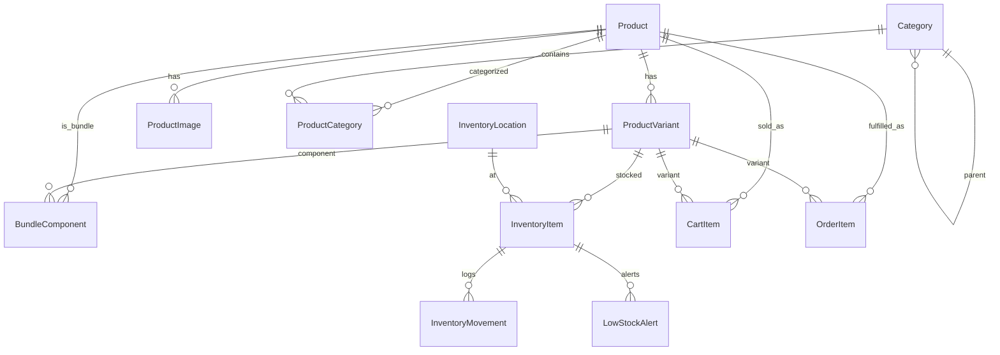
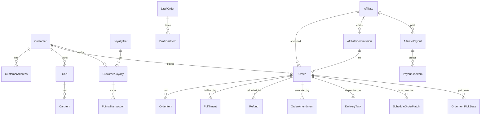
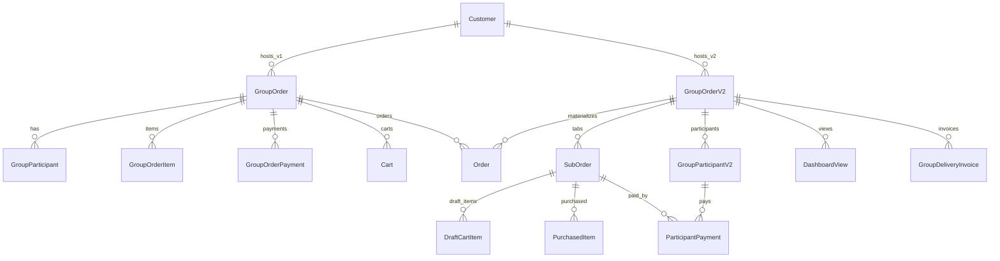
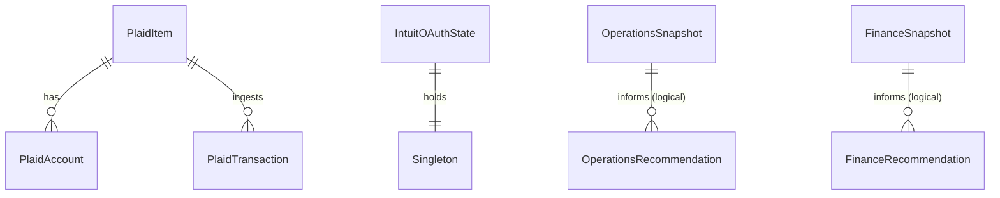
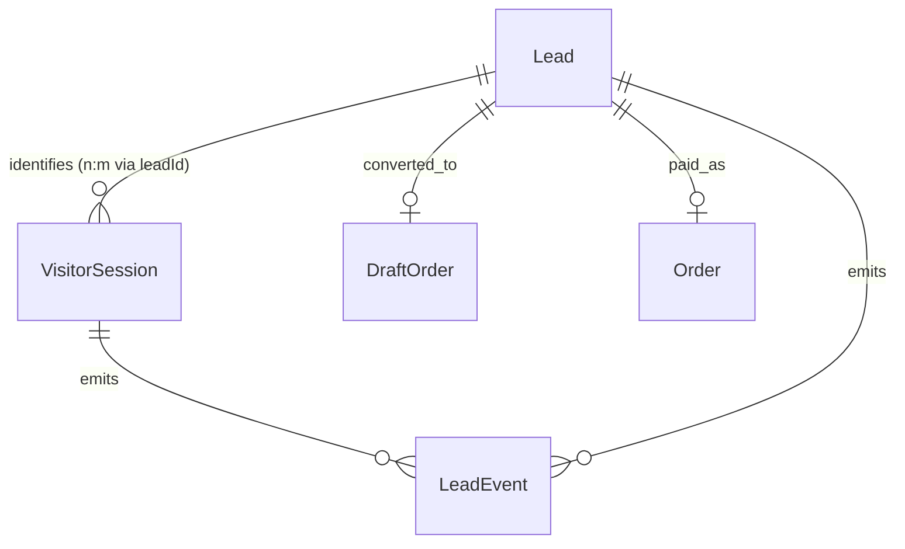

# Data Model

Source of truth: `prisma/schema.prisma`. Datasource is PostgreSQL (`POSTGRES_URL`, `POSTGRES_URL_NON_POOLING`). **109 models, 46 enums** (up from 89 / 46 at the 2026-05-20 sync — added since: the QuickBooks + Stripe + Plaid-sync finance tables, the Shopify order archive and monthly rollup, partner-outreach prospects, the follow-up job/suppression pair, Premiere credit grants, Wayne chat transcripts, inbound email, SEO and GBP snapshots, strategy initiatives, event RSVPs and first-party analytics events).

> **Migrations do NOT go through the Prisma CLI here.** They are hand-written additive SQL under `prisma/migrations/manual/`, applied exactly once via the `_manual_migrations` ledger during the production build. `prisma migrate dev` and `prisma db push` are **forbidden** — the schema is intentionally drifted from production and those commands would drop columns that still hold data. See ADR-0008 and the `db-migration` skill.

> _`DeliveryZone` and `TaxRate` were removed 2026-04-23. Runtime uses hardcoded TS tables in `src/lib/delivery/rates.ts` and `src/lib/tax/rates.ts`. Postgres tables `delivery_zones` and `tax_rates` remain — drop in future migration._
>
> _`LoyaltyTier`, `CustomerLoyalty`, `PointsTransaction` are retained in the schema but the application code that read/wrote them was removed 2026-04-23 (loyalty program deprecated). Models retained for data preservation._

> This document groups models into domain clusters and mirrors the schema verbatim — when fields are listed, they are present in `schema.prisma`. For any model, consult the line numbers below to read the definitive definition.

## Model line index — all 109 models (for grepping in `prisma/schema.prisma`)

| Line | Model | Line | Model | Line | Model |
|---:|---|---:|---|---:|---|
| 13 | PartnerInquiry | 1287 | DeliveryTask | 2540 | AgentConversation |
| 38 | EventRsvp | 1326 | EmailLog | 2564 | AgentProposal |
| 53 | AnalyticsSnapshot | 1404 | FollowUpJob | 2582 | McpRequestLog |
| 97 | AnalyticsEvent | 1448 | EmailSuppression | 2604 | BoatSchedule |
| 138 | GbpReview | 1466 | Discount | 2642 | ScheduleOrderMatch |
| 158 | Experiment | 1528 | PremiereCreditGrant | 2667 | RecommendationItem |
| 188 | ExperimentVariant | 1568 | DiscountUsage | 2703 | OperationsRecommendation |
| 212 | GroupOrderItem | 1584 | ReferralCode | 2732 | OperationsSnapshot |
| 232 | GroupOrder | 1602 | AutomaticDiscount | 2754 | FinanceRecommendation |
| 269 | GroupParticipant | 1651 | LoyaltyTier | 2783 | FinanceSnapshot |
| 299 | OrderAnalytics | 1670 | CustomerLoyalty | 2799 | StrategyInitiative |
| 349 | GroupOrderPayment | 1690 | PointsTransaction | 2826 | IntuitOAuthState |
| 384 | Product | 1719 | VercelEvent | 2844 | PlaidItem |
| 438 | ProductVariant | 1776 | DrinkCalculatorLead | 2864 | PlaidAccount |
| 492 | ProductImage | 1799 | DraftOrder | 2887 | PlaidTransaction |
| 513 | Category | 1949 | GroupOrderV2 | 2935 | PlaidSyncCursor |
| 536 | ProductCategory | 2009 | SubOrder | 2950 | QbAccount |
| 548 | BundleComponent | 2044 | GroupParticipantV2 | 2977 | QbExpense |
| 575 | InventoryLocation | 2069 | DraftCartItem | 3013 | ShopifyOrderArchive |
| 591 | InventoryItem | 2095 | PurchasedItem | 3052 | ShopifyArchiveSyncState |
| 623 | InventoryMovement | 2122 | ParticipantPayment | 3068 | FinanceMonthlyRollup |
| 652 | LowStockAlert | 2157 | EmailTemplateContent | 3097 | QbJournalEntry |
| 693 | Customer | 2172 | InventoryNote | 3135 | QbJournalConfig |
| 741 | CustomerAddress | 2190 | ReceivingInvoice | 3160 | StripePayout |
| 772 | Cart | 2211 | ReceivingInvoiceLine | 3189 | StripeBalance |
| 823 | CartItem | 2234 | DistributorSkuMap | 3205 | ChargeDispute |
| 854 | Order | 2252 | GroupDeliveryInvoice | 3228 | SyncLog |
| 973 | OrderItem | 2274 | WebhookEvent | 3248 | CartShareLink |
| 1011 | OrderItemPickState | 2326 | PartnerApplication | 3274 | SeoSnapshot |
| 1026 | Fulfillment | 2351 | Affiliate | 3311 | VisitorSession |
| 1054 | Refund | 2398 | DashboardTemplate | 3404 | Lead |
| 1109 | OrderAmendment | 2424 | AffiliateWebhookLog | 3490 | InboundEmail |
| 1163 | AIInventoryCount | 2443 | DashboardView | 3518 | ChatConversation |
| 1190 | AIInventoryQuery | 2458 | AffiliateCommission | 3564 | LeadEvent |
| 1204 | InventoryPrediction | 2487 | AffiliatePayout | 3595 | PartnerProspect |
| 1237 | FeatureFlag | 2508 | PayoutLineItem |  |  |
| 1252 | ShopifySync | 2521 | MagicLinkToken |  |  |

## Enums (all 46)

| Enum | Values |
|---|---|
| `ExperimentStatus` | DRAFT, RUNNING, PAUSED, COMPLETED |
| `GroupOrderStatus` | (see line 223) |
| `ParticipantStatus` | (line 231) |
| `PaymentStatus` | (line 237) |
| `HostDecision` | (line 246) |
| `OrderSource` | (line 278) |
| `ProductStatus` | (line 469) |
| `InventoryMovementType` | (line 574) |
| `AlertStatus` | (line 587) |
| `CartStatus` | ACTIVE, ABANDONED, CONVERTED, EXPIRED |
| `OrderStatus` | (line 913) |
| `FinancialStatus` | (line 923) |
| `FulfillmentStatus` | (line 932) |
| `RefundStatus` | (line 941) |
| `AmendmentType` | (line 977) |
| `AmendmentResolution` | (line 984) |
| `DeliveryType` | HOUSE, BOAT, VENUE (line 992) |
| `AICountStatus` | (line 1064) |
| `SyncDirection` | (line 1109) |
| `SyncStatus` | (line 1115) |
| `DeliveryTaskStatus` | (line 1199) |
| `EmailType` | (line 1208) |
| `EmailStatus` | (line 1227) |
| `DiscountType` | (line 1360) |
| `AutoDiscountTrigger` | (line 1367) |
| `PointsType` | (line 1434) |
| `DraftOrderStatus` | (line 1594) |
| `PartyType` | (line 1650) |
| `DashboardSource` | (line 1661) |
| `DeliveryContextType` | (line 1668) |
| `GroupOrderV2Status` | (line 1676) |
| `SubOrderStatus` | (line 1683) |
| `GroupV2ParticipantStatus` | (line 1690) |
| `GroupV2PaymentStatus` | (line 1695) |
| `ApplicationStatus` | (line 2009) |
| `AffiliateStatus` | (line 2015) |
| `AffiliateCategory` | (line 2022) |
| `CommissionStatus` | (line 2031) |
| `PayoutStatus` | (line 2039) |
| `WebhookLogStatus` | (line 2125) |
| `CallbackStatus` | (line 2130) |
| `AgentProposalType` | (line 2262) |
| `AgentProposalStatus` | (line 2267) |
| `LeadStatus` | ANONYMOUS, PARTIAL, SUBMITTED, CONVERTED, ARCHIVED (added 2026-05) |
| `LeadSourceWidget` | QUICK_BUY, PACKAGE_BUILDER, A_LA_CARTE, CALL_BOOKING, EMAIL_SIGNUP, CONTACT_FORM, DRINK_CALCULATOR, OTHER (added 2026-05) |
| `LeadEventType` | PAGE_VIEW, FIELD_FOCUS, FIELD_BLUR, STEP_COMPLETE, CART_ADD, FORM_SUBMIT, CHECKOUT_START, CONVERSION, CUSTOM (added 2026-05) |

## ER diagram — Catalog & Inventory

## ER diagram — Customers, Orders, Fulfilment

## ER diagram — Group orders (v1 + v2)

## Domain: Catalog & Inventory

### Product (line 288)
- Purpose: central product row. Handles, Shopify sync, pricing, ABV, bundle flag.
- Key fields: `id`, `handle` (unique), `title`, `basePrice` Decimal(10,2), `status ProductStatus`, `shopifyId?` (unique), `abv?`, `isBundle`.
- Relations: → `ProductVariant[]`, `ProductImage[]`, `ProductCategory[]`, `InventoryItem[]`, `CartItem[]`, `OrderItem[]`, `DraftCartItem[]`, `PurchasedItem[]`, `BundleComponent[]` (two relations: `BundleProduct` + `ComponentProduct`).
- Touched by: `/api/v1/products*`, `/api/v1/admin/products*`, `/api/products*`, Shopify sync (`src/lib/shopify/`, `ShopifySync` / `SyncLog`).

### ProductVariant (line 342)
- Purpose: price + inventory per SKU/variant (size, 750ml vs 1L).
- Key fields: `sku?`, `price`, `option1..3Name/Value`, `inventoryQuantity`, `committedQuantity`, `trackInventory`, `allowBackorder`, `availableForSale`.
- Relations: → `Product`, `ProductImage?`, `InventoryItem[]`, `InventoryMovement[]`, `CartItem[]`, `OrderItem[]`, `DraftCartItem[]`, `PurchasedItem[]`, `BundleComponent[]`.

### ProductImage (line 396)
- Fields: `url`, `altText`, position, `shopifyId?`. Many-to-one `Product`, one-to-many `ProductVariant`.

### Category (line 417) & ProductCategory (line 440)
- Hierarchical (`parentId` self-relation), with `shopifyCollectionId` sync. Join table `ProductCategory` attaches products to categories.

### BundleComponent (line 452)
- Represents one product inside a bundle (two relations back to `Product`: the bundle and the component). Quantity-bearing.

### InventoryLocation (line 479) / InventoryItem (line 495) / InventoryMovement (line 527) / LowStockAlert (line 556)
- Per-location stock (Austin warehouse, partner locations) with movement ledger and alert queue.
- Enums: `InventoryMovementType`, `AlertStatus`.

### AIInventoryCount / AIInventoryQuery / InventoryPrediction (lines 1002–1063)
- AI-driven: image-based count sessions, natural-language queries, forecasts. Enum `AICountStatus`.

### InventoryNote (1893), ReceivingInvoice (1911), ReceivingInvoiceLine (1932), DistributorSkuMap (1953)
- Workflow: upload distributor invoice photo → OCR/Claude-parse → create `ReceivingInvoice` + `ReceivingInvoiceLine`s → map distributor SKUs (`DistributorSkuMap`) → apply → inventory movement.
- Surfaces at `/ops/inventory/receiving/*`.

## Domain: Customers, Cart, Checkout

### Customer (line 597)
- Fields include `email (unique)`, `passwordHash?`, `ageVerified`, `dateOfBirth?`, `stripeCustomerId?`, `shopifyId?`.
- Relations: addresses, carts, orders, group-order participation (v1 + v2), loyalty (schema-only — code removed 2026-04-23).

### CustomerAddress (645)
- Default `province = "TX"`, `country = "US"`. `isDefault` flag.

### Cart (676) / CartItem (722)
- Server-mirrored cart with delivery details, discounts, cached totals, group-order association, abandonment tracking (`abandonedAt`, `recoveryEmailSent`).
- `CartStatus`: ACTIVE | ABANDONED | CONVERTED | EXPIRED.
- Unique `(cartId, variantId)`.

### Delivery zones / tax rates — _removed 2026-04-23_
- `DeliveryZone` and `TaxRate` Prisma models were removed. Source of truth is now `src/lib/delivery/rates.ts` and `src/lib/tax/rates.ts` (hardcoded TS tables). Postgres tables remain — drop in future migration.

## Domain: Orders & fulfilment

### Order (753)
- Core fields: autoincrement `orderNumber`, `status OrderStatus`, `financialStatus`, `fulfillmentStatus`, Stripe IDs (`stripePaymentIntentId`, `stripeCheckoutSessionId`, `stripeChargeId`), amounts (`subtotal`, `taxAmount`, `deliveryFee`, `tipAmount`, `total`), delivery block, customer snapshot, `groupOrderId?`, `groupOrderV2Id?`, `affiliateId?`, cancellation + review-request fields, optional `shopifyOrderId` for migration.
- Relations: `OrderItem[]`, `Fulfillment[]`, `Refund[]`, `OrderAmendment[]`, `DeliveryTask?`, `AffiliateCommission[]`, `ScheduleOrderMatch[]`.
- Touched by: Stripe webhook, `/api/v1/admin/orders/*`, `/api/v1/orders*`, `/ops/orders*`, reconcile cron.

### OrderItem (837)
- Snapshot of product/variant at time of order with `fulfilledQuantity`, `refundedQuantity`.

### Fulfillment (865), Refund (893), OrderAmendment (948)
- Fulfillment state machine; refund amounts + Stripe refund IDs; amendments (add/remove/substitute) with `AmendmentResolution` workflow.

### DeliveryTask (1126)
- Per-order dispatch row with `DeliveryTaskStatus`. Picker/driver assignment.

### OrderItemPickState (972)
- Persistent pick/pack state for the `/ops/orders` picker UI. One row per `(orderId, itemKey)` capturing `inStock`, `packed`, `shortBy`. `itemKey` is the item title for line items, or `${itemTitle}::${bundleComponentTitle}` for bundle components.
- Replaces prior per-browser localStorage so multiple devices/pickers share the same checkbox + short-by state on a given order. Added 2026-05-03 (commit `86f58c77`).
- Read/written by `/api/ops/orders/[id]/picks` (GET/PUT). Deleted by cascade when the parent `Order` is deleted.

### DraftOrder (1526), DraftCartItem (1793)
- Admin-created invoices. Token-based customer view at `/invoice/[token]`. `DraftOrderStatus` enum.

### GroupDeliveryInvoice (1971)
- Split delivery invoice issued from a GroupOrderV2 tab.

## Domain: Group orders (v1 + v2)

### v1 (legacy)

- **GroupOrder** (136): share code, host, delivery info, `multiPaymentEnabled`, `hostDecision`, expirations.
- **GroupParticipant** (173), **GroupOrderItem** (116), **GroupOrderPayment** (253) — per-participant carts and split payment.
- **OrderAnalytics** (203) — reporting-time rollup.

### v2 (universal dashboard)

- **GroupOrderV2** (1702) — code-addressable; `PartyType`, `DashboardSource`, `DeliveryContextType`, `GroupOrderV2Status`.
- **SubOrder** (1736) — "tab" under a group order; `SubOrderStatus`.
- **GroupParticipantV2** (1768) — guest/host with `GroupV2ParticipantStatus`.
- **DraftCartItem** (1793) — pre-purchase.
- **PurchasedItem** (1819) — post-purchase snapshot.
- **ParticipantPayment** (1846) — per-participant Stripe payments; `GroupV2PaymentStatus`.
- **DashboardView** (2156) — view/telemetry records per dashboard.
- **DashboardTemplate** (2111) — reusable dashboard templates (affiliate-created).

## Domain: Discounts, loyalty, experiments

- **Discount** (1241), **DiscountUsage** (1295), **ReferralCode** (1311), **AutomaticDiscount** (1329) — promo codes, usage caps, auto-rules; `DiscountType`, `AutoDiscountTrigger`.
- **LoyaltyTier** (1378), **CustomerLoyalty** (1397), **PointsTransaction** (1417) — tiered loyalty points; `PointsType` enum. _Code that read/wrote these models was removed 2026-04-23. Models retained for data preservation; tables can be dropped in a future migration._
- **Experiment** (66) + **ExperimentVariant** (95) — A/B testing with impressions/clicks/conversions/revenue per variant; `ExperimentStatus`.

## Domain: Affiliates & partners

- **PartnerInquiry** (13) — early partner leads.
- **PartnerApplication** (2045) — formal applications with `ApplicationStatus`.
- **Affiliate** (2070) — approved partners; `AffiliateStatus`, `AffiliateCategory`.
- **MagicLinkToken** (2230) — affiliate passwordless auth.
- **AffiliateCommission** (2167), **AffiliatePayout** (2196), **PayoutLineItem** (2217) — `CommissionStatus`, `PayoutStatus`.
- **AffiliateWebhookLog** (2137) — outbound webhook delivery log; `WebhookLogStatus`, `CallbackStatus`.
- **DashboardTemplate** (2111), **DashboardView** (2156) — affiliate-branded dashboards.

## Domain: Content, analytics, leads

- **AnalyticsSnapshot** (34) — daily GA4/GSC rollup.
- **VercelEvent** (1719) — raw server-side request logs ingested via `/api/webhooks/vercel-drain`; page views and bot classification are derived from them in `src/lib/analytics/vercel-events.ts`.
- **DrinkCalculatorLead** (1503) — lead capture from the drink calculator.
- **EmailLog** (1165) — every Resend send keyed by `EmailType` + `EmailStatus`.
- **EmailTemplateContent** (1878) — editable template bodies.
- **FeatureFlag** (1076) — runtime flags surfaced via `/api/v1/features`.

## Domain: Sync & integrations

- **ShopifySync** (1091), **SyncLog** (2371) — Shopify Admin API ingest control; `SyncDirection`, `SyncStatus`.
- **WebhookEvent** (1993) — idempotency for Stripe / Shopify / Resend.

## Domain: AI agent

- **AgentConversation** (2249), **AgentProposal** (2273), **McpRequestLog** (2291) — agent sessions, proposed mutations, MCP request audit log. `AgentProposalType`, `AgentProposalStatus`.

## Domain: Operations Director (added 2026-05)

Phase 1B+ of the Operations Director pipeline. Schema notes live in `prisma/schema.prisma` and the long-form spec is at `docs/OPERATIONS-DIRECTOR-AGENT-BUILDOUT.md` §5a / §12. The Marketing/SEO equivalent is `RecommendationItem` — Operations is intentionally a parallel model rather than a unified table so the shared lib at `src/lib/recommendations/{lifecycle,measurement,card-types}.ts` can serve both.

### OperationsRecommendation
- Purpose: queue of detector-generated recommendations surfaced in `/admin/recommendations` (filtered by `domain=operations`) and `/admin/operations`.
- Key fields: `signalKind`, `severity` (`urgent` | `high` | `normal`), `title`, `evidence Json`, `targetEntityType`, `targetEntityId`, `actionPayload Json`, `status` (default `open`), `snoozeUntil?`, `dismissReason?`, `actionLog Json[]`, `source` (default `auto-snapshot`), `shippedAt?`, `measuredAt?`, `measurementResult? Json`, **unique** `dedupeKey` (= `signalKind:targetEntityId`).
- Indexed by `status`, `(severity, status)`, `(signalKind, status)`.
- Touched by: `/api/cron/operations-snapshot`, `/api/cron/operations-drift-hourly`, `/api/cron/measure-operations-recommendations`, `/api/admin/recommendations/*`, `/admin/operations`, `npm run sync:operations` (Obsidian mirror).

### OperationsSnapshot
- Purpose: one row per snapshot run — powers the dashboard trend sparklines and the Monday briefing.
- Key fields: `capturedAt`, `inventoryAccuracyPct?`, `driftEventsTotal`, `driftEventsBySignal Json`, `urgentShortagesCount`, `costCoveragePct`, `receivingLagP50Hours?`, `receivingLagP90Hours?`, `cycleCountsCompletedLast7d`, `paidOrders14dShortageCount`.
- Indexed by `capturedAt`.

### RecommendationItem — domain discriminator (existing model, new field)
- New field `domain String @default("marketing")` (`marketing` | `seo`) + new index `(domain, status)`. SEO-director sourced rows use `source = 'seo-director'`. See ADR S0001 in the Obsidian vault.

## Domain: Finance Director (added 2026-05)

Phase 0 scaffolding for the Finance Director pipeline — see `docs/FINANCE-DIRECTOR-AGENT-BUILDOUT.md`. Phase 0 ships empty tables; Phase 1C+ populates and reconciles.

### FinanceRecommendation
- Mirror of `OperationsRecommendation` (same field set, same dedupe key strategy). Exists so the shared `src/lib/recommendations/*` lib serves Finance too. Phase 0 ships empty.

### FinanceSnapshot
- Purpose: one row per finance cron run. Key fields: `snapshotDate Date`, `payload Json`, `createdAt`. Indexed by `snapshotDate`. Payload schema defined per-phase.

### IntuitOAuthState
- Purpose: **single-row** singleton (`id = "singleton"`) holding the QuickBooks Online OAuth state.
- Key fields: `realmId`, `accessToken @db.Text`, `refreshToken @db.Text`, `accessTokenExpires`, `refreshTokenExpires`, `environment` (`sandbox` | `production`), `lastRefreshedAt?`, `lastError?`.
- Written by `/api/admin/finance/qb/callback`; refreshed in place when the access token rotates.

### PlaidItem
- Purpose: one row per linked Plaid Item (institution).
- Key fields: unique `itemId`, `accessToken @db.Text`, `institutionId?`, `institutionName?`, `environment` (`sandbox` | `development` | `production`), `status` (`active` | `login_required` | `error` | `removed`), `lastSyncAt?`, `lastError?`.
- Relations: → `PlaidAccount[]`, `PlaidTransaction[]` (cascade delete).

### PlaidAccount
- Purpose: one account within a Plaid Item (checking / savings / credit card).
- Key fields: unique `accountId`, `plaidItemId` (FK), `name`, `officialName?`, `mask?`, `type` (`depository` | `credit` | `loan` | `investment`), `subtype?`, `currentBalance Decimal(15,2)`, `availableBalance Decimal(15,2)`, `isoCurrencyCode` (default `USD`).

### PlaidTransaction
- Purpose: bank transactions ingested via Plaid webhook + nightly sync. Phase 0 ships empty; Phase 2C populates and reconciles against Stripe payouts / receiving invoices / QBO.
- Key fields: unique `transactionId`, `plaidItemId` (FK), `accountId`, `date Date`, `authorizedDate? Date`, `amount Decimal(15,2)` (positive = outflow per Plaid), `name`, `merchantName?`, `pending`, `paymentChannel?`, `category String[]`, `personalFinanceCategoryPrimary?`, `personalFinanceCategoryDetailed?`, `matchedStripePayoutId?`, `matchedReceivingInvoiceId?`, `qbTransactionId?`, `qbCategoryAssigned?`, `reconciledAt?`.
- Indexed by `plaidItemId`, `date`, `(accountId, date)`, `reconciledAt`.

### PlaidSyncCursor (2935)
- Per-Item cursor for Plaid's incremental `/transactions/sync` (added/modified/removed since the stored cursor). One row per `PlaidItem`.

### QbAccount (2950) / QbExpense (2977)
- QuickBooks Chart-of-Accounts cache and cached expense transactions (QB Purchase + Bill), pulled by `/api/cron/finance-qb-pull`. Upsert key `qbTransactionId`, so re-pulls are idempotent.

### QbJournalEntry (3097) / QbJournalConfig (3135)
- Per-day sales journals posted PartyOn → QuickBooks. Drafted by the daily cron; posting **requires operator approval**. `QbJournalConfig` is the single-row operator-edited mapping from revenue/expense concepts to QB account ids (edited at `/admin/finance/journals/settings`, deliberately in the DB rather than env vars).

### StripePayout (3160) / StripeBalance (3189) / ChargeDispute (3205)
- Stripe payouts to the bank (reconciled against Plaid deposits), daily balance snapshots ("how much is in Stripe vs the bank?"), and one row per dispute lifecycle updated on every `charge.dispute.*` webhook.

### ShopifyOrderArchive (3013) / ShopifyArchiveSyncState (3052)
- Thin financial snapshot of every Shopify order ever processed, powering multi-year rollups. **Not** a replacement for `Order` — `Order` remains the system of record for the current era. `ShopifyArchiveSyncState` is the single-row backfill/incremental tracker.

### FinanceMonthlyRollup (3068)
- Pre-computed monthly trajectory, one row per (year, month). **UNIONs the two revenue eras** — `ShopifyOrderArchive` (≤2025-12) + `Order` (≥2026-01), deduped — and layers QB OpEx where available. Anything reading revenue across both eras must go through this, not either table alone.

## Domain: Lead capture & visitor tracking (added 2026-05)

Three loosely-coupled tables powering the lead-tracking system surfaced at `/admin/brians-stuff?tab=leads`. A session may exist without a lead (anonymous browsing). A `Lead` is created the first time any of email/phone/name is captured; subsequent events on the same session re-attach to the lead. Re-identification across sessions is supported via `Lead.sessions[]`.

### VisitorSession
- Purpose: one row per anonymous browser session (cookie-based).
- Key fields: unique `cookieId` (= `pod_vsid` cookie), `firstSeenAt`, `lastSeenAt`, `pageViewCount`, `eventCount`, `landingPage?`, `referrer?`, UTM bag (`utmSource/Medium/Campaign/Content/Term`), `ipAddress?`, geo (`city/region/country/postalCode`), enrichment bag (`enrichedCompany/Industry/Role/Size`), `userAgent?`, `deviceType?`, `metadata? Json`, `leadId?` (denormalized FK).
- Relations: → `Lead?` (m:1 via leadId), `LeadEvent[]`.
- Indexed by `leadId`, `firstSeenAt`, `lastSeenAt`.

### Lead
- Purpose: one row per identifiable person.
- Key fields: `email?`, `phone?`, `firstName?`, `lastName?`, `status LeadStatus` (default `PARTIAL`), `sourcePage?`, `sourceWidget? LeadSourceWidget`, `lastPage?`, UTM bag (first-touch), `resumeCart? Json` (used to resume "finish your order"), `draftOrderId?`, `orderId?`, `metadata? Json`, `notes? @db.Text`.
- Relations: → `LeadEvent[]`, `VisitorSession[]`.
- Indexed by `email`, `phone`, `status`, `createdAt`, `draftOrderId`.

### LeadEvent
- Purpose: one row per atomic interaction (field blur, page view, form submit, step complete, etc.).
- Key fields: `leadId?` (FK), `sessionId?` (FK), `type LeadEventType`, `page?`, `widget?`, `fieldName?`, `fieldValue? @db.Text` (truncated to 1000 chars upstream), `metadata? Json`, `occurredAt`.
- Indexed by `leadId`, `sessionId`, `type`, `occurredAt`.
- Written by `/api/v1/landing/visitor-pixel` (PAGE_VIEW) and `/api/v1/landing/lead-event` (everything else); read by `/admin/brians-stuff?tab=leads`.

## Domain: Shared cart links (added 2026-05)

### CartShareLink
- Purpose: short-link record for the `/s/<slug>` redirect → `/cart/shared?c=…&t=…` flow.
- Key fields: unique `slug` (4–16 chars `[A-Za-z0-9]`), `cartData @db.Text` (base64 `c` payload), `token` (base36 `t` timestamp), `expiresAt`, `viewCount` (incremented on each `/s/<slug>` resolve).
- Indexed by `expiresAt`.

## Domain: Order tracking — Upsell A/B (existing models, new fields)

### DraftOrder — new field
- `upsellVariantId String?` — landing-page pre-checkout upsell A/B tracking. Records which arrangement of the overlay was shown. Per-item upsell attribution lives in the items JSON (each item may carry `{ ..., viaUpsell: true }`). Index on `upsellVariantId`.

### SubOrder — delivery date (changed 2026-08-01, PR #348)
- `deliveryDate DateTime?` and `orderDeadline DateTime?` are **nullable**. NULL means *the customer has not chosen a date yet* — self-serve dashboards are now born dateless. They used to be NOT NULL, so the service invented a "creation + 7 days" placeholder that silently became the real delivery date on orders.
- `deliveryDateConfirmed Boolean @default(false)` — true only when a human chose the date. Creation paths that receive a real date (Premier booking webhook, event presets, quote flow, affiliate portal) set it at creation; a date PATCH is the only other way it flips true.
- Both group checkout routes refuse (`DELIVERY_DATE_REQUIRED`) unless the tab has a date **and** the flag, and refuse a past date (`DELIVERY_DATE_PAST`).
- `deliveryDate` is stored at **noon UTC**. Compare it as a calendar day in `America/Chicago` (`todayCT()`), never as an instant — noon UTC is 7am CT, so an instant comparison rejects every same-day order placed after breakfast.
- A NULL `orderDeadline` never matches the auto-lock cron's `lt: now`, so dateless tabs stay OPEN rather than locking against an invented deadline.

## Domain: Boat schedule

- **BoatSchedule** (2313), **ScheduleOrderMatch** (2351) — pairs orders with boat trips (surfaces at `/ops/boat-schedule`, `/premier-boat-schedule`, `/api/*/boat-schedule/*`).

## Domain: Partner outreach 2.0 (added 2026-07)

### PartnerProspect (3595)
- One row per prospect company, deduped globally by `websiteKey` (host+path). Replaces the old static JSON prospect lists. The research dossier lives in `enrichment`; drafted outreach copy and A/B arm live alongside it. Surfaced at `/admin/affiliates/prospects/*`.

## Domain: Follow-up email system (added 2026-07)

### FollowUpJob (1404)
- One scheduled follow-up send per journey step per entity. `dedupeKey` makes re-enqueues free. Table created by `prisma/migrations/manual/2026-07-06-followups-phase-0.sql`.

### EmailSuppression (1448)
- Global do-not-email list for follow-up sends. **Transactional email bypasses it** — order confirmations still go out.

## Domain: Premiere credits (added 2026-07)

### PremiereCreditGrant (1528)
- One row per credit sourced from the Premiere "POD Credits" sheet. Each grant mints a **single-use FIXED_AMOUNT `Discount`** and delivers the code by email + SMS. Billing rule: invoice Premiere only for *redeemed* codes (`usageCount ≥ 1`).

## Domain: SEO & reputation

### SeoSnapshot (3274)
- One row per (surface × capture run) from the SEMrush scrape job.

### GbpReview (138)
- Google Business Profile reviews, including our reply text.

## Domain: Conversational + inbound capture

### ChatConversation (3518)
- One row per Wayne (AI concierge) conversation, keyed by a client-generated `conversationId`; `/api/chat` upserts the full message history each turn. Linked to its `Lead` once contact details are captured.

### InboundEmail (3490)
- Customer email received at info@partyondelivery.com, pulled by the Gmail poller and linked to its `Lead` so the board drawer can show what people are emailing in. One row per Gmail message.

### AnalyticsEvent (97)
- First-party analytics events (name + `occurredAt` + payload), independent of GA4.

## Domain: Admin strategy & events

### StrategyInitiative (2799)
- Human-authored strategic initiatives for the `/admin/strategy` living document. Deliberately distinct from the machine-detected recommendation queues: these are owned, prioritized and hand-tracked.

### EventRsvp (38)
- RSVPs for one-off events (e.g. `/dads-gone-wild`). Written by a one-shot script, **not** the auto-apply migration ledger; listed at `/ops/rsvps`.

## Migrations & seed data

- Migrations are **hand-written additive SQL** under `prisma/migrations/manual/`, applied exactly once via the `_manual_migrations` ledger (`scripts/db/apply-manual-migrations.mjs`, run at the front of the production build). See `prisma/migrations/manual/README.md` and ADR-0008.
- **`prisma migrate dev` and `prisma db push` are FORBIDDEN against this database** — a PreToolUse hook blocks them. `prisma/schema.prisma` is intentionally drifted from production (some removed columns still hold data), so those commands would drop real data. Use the `db-migration` skill.
- Backups present in repo: `prisma/schema-backup.prisma`, `prisma/schema-original.prisma` — historical only.
- Seed data: _No explicit `prisma/seed.ts` referenced in `package.json`._ Blog posts are filesystem-based under `content/blog/posts/` (123 `.mdx` files) and do not live in Prisma.
- Product seed: catalog is populated via Shopify Admin API sync (`src/lib/shopify/`, `src/lib/sync/`) rather than Prisma seeds.

## See also

- [[INDEX]]
- [[01-overview]]
- [[02-tech-stack-and-architecture]]
- [[03-routes-and-pages]]
- [[04-customer-journey]]
- [[06-admin-features]]
